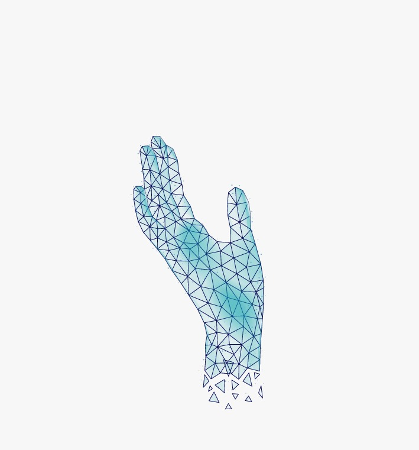

<h1 align="center">
  Tutur
</h1>
<p align="center">Help Communicate for Better Future</p>

<p align="center">
    
</p>

<br>

## Description

Tutur merupakan aplikasi kecerdasan buatan untuk translasi bahasa isyarat yang berbasis web. Kita dapat dengan mudah berkomunikasi dengan mereka hanya melalui kamera hp. Video yang terekam akan diproses untuk dapat mendeteksi gerakan bahasa isyarat dan ditranslasikan dalam bentuk teks ataupun suara. Untuk merespon ucapan isyarat mereka, kita juga dapat mentranslasikan teks menjadi bahasa isyarat sehingga komunikasi dengan mereka akan lebih mudah.

## Design

https://www.figma.com/file/qXNfBJWfNiQNg72w25LK2F/UI

## Branch Naming

`<type>/<short_description>`

- `<type>` :
  - feature: saya menambahkan fitur baru
  - fix: saya memperbaiki fitur

contoh: feature/menambahkan-navbar <br/>
[Learn More](https://nvie.com/posts/a-successful-git-branching-model/)

## Commit Messages

`<type>(scope): <short_summary>` <br/>
[Baca lebih lengkap](https://gist.github.com/joshbuchea/6f47e86d2510bce28f8e7f42ae84c716)

## Folder Structure

```
- docs: asset dokumentasi
- public: bisa diakses public
- components
  - elements: component element satuan
  - layouts: component layout
  - templates: component template yang dapat digunakan berulang kali
- pages: halaman - halaman
- styles: styling css
- utils
  - helpers: pembantu
  - hooks: react hook
- ml: machine learning development code 
```

## Clean Code

- [Learn More](https://github.com/ryanmcdermott/clean-code-javascript)
- [Learn More 2](https://gist.github.com/wojteklu/73c6914cc446146b8b533c0988cf8d29#:~:text=Code%20is%20clean%20if%20it,%2C%20changeability%2C%20extensibility%20and%20maintainability.)
